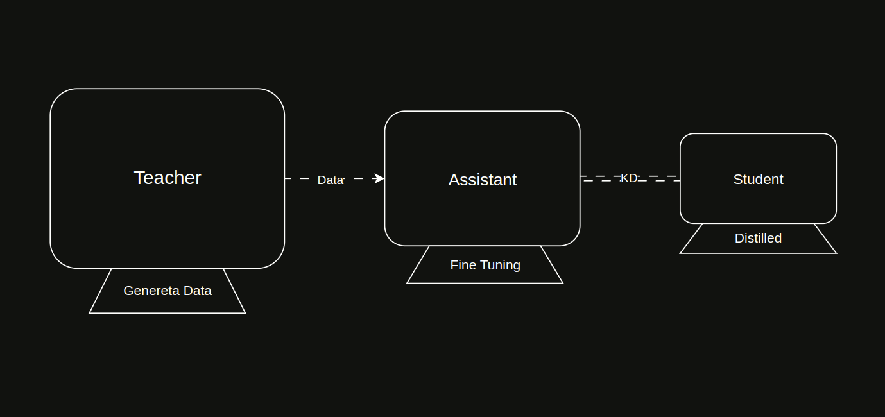

<div align="center">

# TAS

The TAS (Teacher-Assistant-Student) repository contains code demonstrating how "knowledge" acquired by a large-scale,
open or closed-source language model (LLM) can be transferred to a relatively smaller student model through an
intermediate assistant model. For a more detailed explanation and general overview, please refer to
the [Introduction](#introduction) section.

**Note**: _If you would like to contribute to this repository, please read the `CONTRIBUTING` file under
the [Documentation](#documentation) section first._


[](https://linkedin.com/in/bunyaminergen)

</div>

---

### Table of Contents

- [Introduction](#introduction)
- [Architecture](#architecture)
- [Features](#features)
- [Inference](#inference)
- [Prerequisites](#prerequisites)
- [Installation](#installation)
- [File Structure](#file-structure)
- [Documentation](#documentation)
- [License](#licence)
- [Links](#links)
- [Team](#team)
- [Contact](#contact)
- [Citation](#citation)

---

### Introduction

There are numerous methods for performing knowledge distillation using Teacher, Assistant, and Student models. To put it
simply, the goal is to transfer the "knowledge" from a foundational LLM—whether open-source or proprietary (also
referred to as whitebox or blackbox models)—to a Student model via an intermediate Assistant model.

Although there may be slight variations across different studies, the general workflow typically follows this pattern:

1. Generate data using the Teacher model.
2. Fine-tune the Assistant model using this data.
3. Perform knowledge distillation (KD) from the Assistant to the Student model.

Different approaches may include additional variations—for example, using both token-based and sequence-based
distillation between the Assistant and the Student models. Research has shown that such hybrid techniques can yield
better results. However, in this specific study, only token-based distillation was used.

Additionally, in this study, to optimize both cost and training time, data was generated from the Teacher model for
Supervised Fine-Tuning (SFT), and the Assistant model was fine-tuned using this data.

Please refer to the `RESOURCES` file under the [Documentation](#documentation) section to explore the method
used in this repository as well as other alternative techniques.

For detailed information about the models, please refer to the [Inference](#inference) section.

---

### Architecture



---

### Features

##### Models

- [x] SFT Dataset: Supervised data generated from the Teacher model
- [x] Small-scale (1B) model(Student) with low compute requirements
- [x] Code generated with descriptive Google-style docstrings

##### Code

- [x]  Advanced logging
- [x]  Local experiment tracking with MLflow
- [x]  Dataset generation using Distributed DataParallel (DDP)

---

### Inference

##### Assistant Model

- [bunyaminergen/Qwen2.5-Coder-1.5B-Instruct-SFT](https://huggingface.co/bunyaminergen/Qwen2.5-Coder-1.5B-Instruct-SFT)

##### Student Model

- [bunyaminergen/Qwen2.5-Coder-1.5B-Instruct-SFT-Distilled](https://huggingface.co/bunyaminergen/Qwen2.5-Coder-1.5B-Instruct-SFT-Distilled)

##### Teacher Model's Dataset

- [bunyaminergen/Stable-Code-Python-SFT](https://huggingface.co/datasets/bunyaminergen/Stable-Code-Python-SFT)

**Note**: _as a Teacher: `stabilityai/stable-code-instruct-3b`_

---

### Prerequisites

##### Inference

- `1x GPU (min 12GB)`
- `Hugging Face Credentials (Account, Token)`

##### Training from Scratch

- Teacher's Dataset Generation

- `2x GPU (min 24GB)`

- Assistant Model Training (SFT)

- `1x GPU (min 48GB)`

- Distillation

- `1x GPU (min 48GB)`

---

### Installation

##### Linux/Ubuntu

```bash
sudo apt update -y && sudo apt upgrade -y
```

```bash
git clone https://github.com/bunyaminergen/TAS
```

```bash
cd TAS
```

```bash
conda env create -f environment.yaml
```

```bash
pip install flash-attn --no-build-isolation
```

```bash
conda activate TAS
```

```bash
python main.py
```

**for DDP:**

```bash
torchrun --nproc_per_node=2 main.py
```

##### Environment Variables

`.env` file sample:

```Text
# OpenAI
OPENAI_API_KEY=

# Hugging Face
HUGGINGFACE_TOKEN=
```

---

### File Structure

```text
.
├── .docs
│   ├── documentation
│   │   ├── CONFIG.md
│   │   ├── CONTRIBUTING.md
│   │   └── RESOURCES.md
│   └── img
│       └── architecture
│           ├── TAS.drawio
│           ├── TAS.gif
│           ├── TAS.jpg
│           └── TAS.png
├── .env
├── environment.yaml
├── .github
│   └── CODEOWNERS
├── .gitignore
├── LICENSE
├── main.py
├── README.md
├── requirements.txt
└── src
    ├── config
    │   ├── config.yaml
    │   └── prompt.yaml
    ├── model
    │   ├── core.py
    │   └── loss.py
    ├── process
    │   └── train.py
    └── utils
        ├── common
        │   └── helpers.py
        ├── data
        │   └── manager.py
        ├── log
        │   └── manager.py
        └── type
            └── schema.py

15 directories, 24 files
```

---

### Documentation

- [CONFIG](.docs/documentation/CONFIG.md)
- [RESOURCES](.docs/documentation/RESOURCES.md)
- [CONTRIBUTING](.docs/documentation/CONTRIBUTING.md)

---

### Licence

- [LICENSE](LICENSE)

---

### Links

- [Github](https://github.com/bunyaminergen/TAS)
- [Website](https://bunyaminergen.com)
- [Linkedin](https://www.linkedin.com/in/bunyaminergen)

---

### Team

- [Bunyamin Ergen](https://www.linkedin.com/in/bunyaminergen)

---

### Contact

- [Mail](mailto:info@bunyaminergen.com)

---

### Reference

##### Datasets

The following datasets were used as sources of `instruction` keys for generating the SFT dataset:

- [nikhiljatiwal/Llama-3.2-Python-Alpaca-143k](https://huggingface.co/datasets/nikhiljatiwal/Llama-3.2-Python-Alpaca-143k)
- [jtatman/python-code-dataset-500k](https://huggingface.co/datasets/jtatman/python-code-dataset-500k)

##### Models

As a Teacher:

- [stabilityai/stable-code-instruct-3b](https://huggingface.co/stabilityai/stable-code-instruct-3b)

As the base Assistant (before SFT):

- [Qwen/Qwen2.5-Coder-1.5B-Instruct · Hugging Face](https://huggingface.co/Qwen/Qwen2.5-Coder-1.5B-Instruct)

### Citation

```bibtex
@software{       TAS,
  author       = {Bunyamin Ergen},
  title        = {{TAS}},
  year         = {2025},
  month        = {04},
  url          = {https://github.com/bunyaminergen/TAS},
}
```

---
